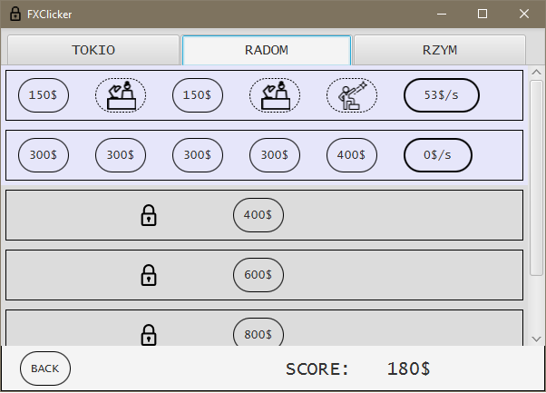

# JavaFXBuilder - desktop clicker game

Simple builder game created with Java FX with CSS touch.

## General info

The game made for 1st year GUI classes at Polish-Japanese Academy of Information Technology.

Player has to earn and spend money - buying new rooms and hiring workers in three different locations.

## Illustration

## Technologies

JavaFX 

## Credits

Icons made by: Freepik, Appzgear from www.flaticon.com 

Thomas Harmel from www.freevector.com

 
